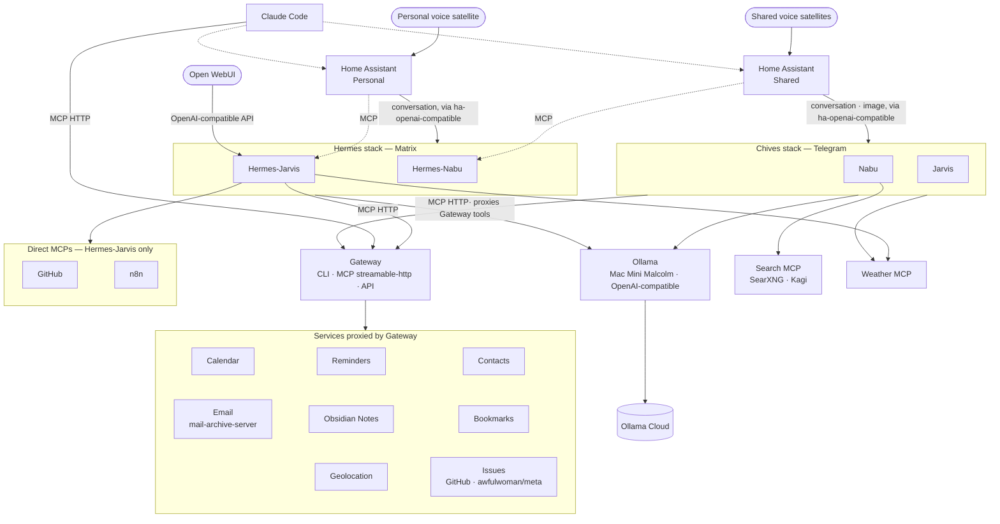

# Personal Cloud

A high-level, aspirational overview of my personal cloud - the self-hosted personal automation ecosystem I'm steering towards.

## Overview

## Systems

### Gateway

Presents a proxy interface for many other services, in the form of CLI, MCP, and API.

The MCP interface is served over streamable-http (`http://host:4000/mcp`). Clients register with `claude mcp add --transport http`, rather than the old SSE endpoint or hand-edited config.

Will soon have authentication and authorisation layers that allow it to be used by various systems in different ways.

- Calendar (real Apple Calendar via [apple-calendar-server](https://github.com/awfulwoman/apple-calendar-server) — replaced Google Calendar)
- Reminders (real Apple Reminders via [apple-reminders-server](https://github.com/awfulwoman/apple-reminders-server) — replaced Radicale)
- Contacts (real macOS Contacts via [apple-contacts-server](https://github.com/awfulwoman/apple-contacts-server) — replaced Radicale)
- Email (multi-account IMAP sync + search via [mail-archive-server](https://github.com/awfulwoman/mail-archive-server))
- Obsidian notes
- Bookmarks (Karakeep)
- Issues (GitHub issues in a single repo, default `awfulwoman/meta`, via the GitHub REST API)
- Geolocation (OwnTracks)

The three Apple-backed services run natively on Malcolm (the always-on Mac), since EventKit and the Contacts framework are macOS-only and need a logged-in GUI session for the permission grant. Everything else runs in the Gateway container itself.

Personal Site, Mastodon, Photos, Weather, and Search were on this list in an earlier draft of this document but were never built into Gateway — Weather and Search instead ended up as their own standalone MCP servers (see below), and the rest remain unbuilt.

### Ollama

Runs on a Mac Mini (Malcolm) where it can, if needed, use local LLM models. Practically it's connected to Ollama Cloud. Presents an OpenAI-compatible interface.

Used by both agent stacks below.

### Ollama Cloud

Allows access to cloud-based models via Ollama.

### Chives stack (Nabu · Jarvis)

The original agent stack: [Chives](https://github.com/awfulwoman/chives), a local-first Python agent talking to Ollama and reaching Gateway's tools by proxying them over MCP HTTP. Runs as two Telegram bots, `nabu` and `jarvis`, deployed on `server-64gb-storage`. Each is its own container with its own Telegram token, memory, and scheduled nudges.

Also has the Home Assistant MCP and a weather MCP wired in, so it can act on Home Assistant state and answer weather questions directly, not just through Gateway.

### Hermes stack (Hermes-Nabu · Hermes-Jarvis)

A newer, parallel agent stack: [Hermes Agent](https://github.com/NousResearch/hermes-agent), a self-hosted agent from Nous Research, run as one container per identity (`hermes-nabu`, `hermes-jarvis`) on `minipc-8gb-agatha`. Talks to the same Ollama endpoint on Malcolm. Chat happens over Matrix rather than Telegram, and each container exposes its own OpenAI-compatible API (port 8642) so other systems — Home Assistant, Open WebUI — can drive it directly.

The two identities have very different tool access:

- **Hermes-Nabu** (house agent) — only the Home Assistant MCP.
- **Hermes-Jarvis** (general assistant) — the Gateway MCP (full tool set), the Home Assistant MCP, a weather MCP, GitHub's hosted MCP server (via a dedicated helperbot account, for forking public repos and opening PRs/issues), and n8n's instance MCP.

An earlier single multi-profile `hermes-agent` container ran both identities as Hermes "profiles," but profiles share one process environment — all of them ended up authenticating to Matrix as the same account (an acknowledged upstream bug). Splitting into one container per identity fixed that.

`hermes-nabu`/`hermes-jarvis`, rather than plain `nabu`/`jarvis`, because the Chives stack already owns those composition names and subdomains — the two stacks are unrelated but collide on naming, both having been built around the same `nabu`/`jarvis` Home Assistant wake words.

### Open WebUI

A chat frontend, deployed alongside the Hermes stack on `minipc-8gb-agatha` specifically so it can reach Hermes-Jarvis's API server by container name on the shared Docker network.

### Home Assistant - Shared

The interface to our home. Provides automations, dashboards, and connections to various physical hardware, such as Zigbee networks, Thread networks, and various home devices.

Uses the [`ha-openai-compatible`](https://github.com/awfulwoman/ha-openai-compatible) custom integration (a fork of HA's core OpenAI integration with a configurable base URL) to point its conversation agent at an agent stack's OpenAI-compatible endpoint, and separately connects to Hermes-Nabu over MCP.

### Home Assistant - Personal

A separate Home Assistant instance that connects to a single voice satellite.

Same `ha-openai-compatible` wiring as above, pointed at the personal-agent identity, plus a direct MCP connection to Hermes-Jarvis.

### Claude Code

Agent harness from Anthropic.

Connects to Gateway and Home Assistant.

## Notes

Jarvis and Nabu (and now Hermes-Jarvis and Hermes-Nabu) are only used because they are hardcoded as wake words in the Home Assistant voice satellites — hence two unrelated agent stacks both being built around the same two names.

## Emerging

- **[wiki-compiler](https://github.com/awfulwoman/wiki-compiler)** — not yet deployed. Will compile the Obsidian vault and Gateway's data (calendar, bookmarks, contacts, reminders, location) into an Obsidian-compatible wiki that an LLM maintains, with a citation on every fact. Currently at the milestone-1 design/spec stage.
