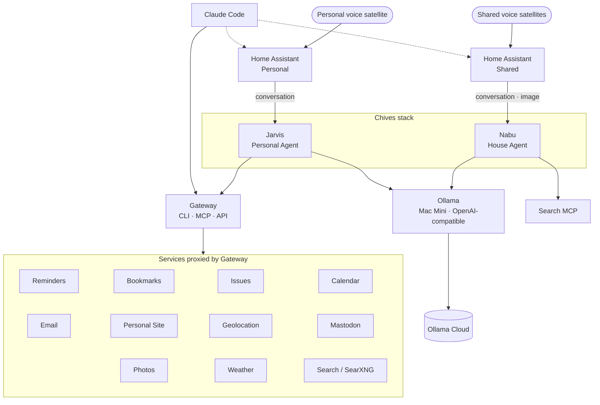

# Personal Cloud

A high-level, aspirational overview of my personal cloud - the self-hosted personal automation ecosystem I'm steering towards.

## Overview

## Systems

### Gateway

Presents a proxy interface for many other services, in the form of CLI, MCP, and API.

Will soon have authentication and authorisationh layers that allows it to be used by various systems in different ways.

- Reminders (Apple Reminders)
- Bookmarks (Karakeep)
- Issues
- Calendar (Apple Calendar)
- Email (IMAP)
- Personal Site
- Geolocation (Owntracks)
- Mastodon
- Photos (Immich)
- Weather (some weather API)
- Search (SearXNG)

### Ollama

Runs on a Mac Mini where it can, if needed, use local LLM models. Practically it's connected to Ollama Cloud. Presents an OpenAI-compatible interface.

Used by the Nabu and Jarvis agents.

### Ollama Cloud

Allows access to cloud-based models via Ollama.

### Home Assistant - Shared

The interface to our home. Provides automations, dashboards, and connections to various physical hardware, such as Zigbee networks, Thread networks, and various home devices.

Makes use of Nabu, the house agent.

### Nabu - House Agent

An always on agent that is powered by Ollama and connected a search MCP (and any other MCPs as needed).

Home Assistant connects to this and makes use of it for the conversational and image capabilities.

Uses the Chives stack.

### Jarvis - Personal Agent

An always on looping agent that is powered by Ollama and connected to Gateway.

Home Assistant Personal connects and makes use of this for the conversational capabilities.

Uses the Chives stack.

### Home Assistant - Personal

A seperate home assistant instance that connects to a single voice satellite.

Used by me for all the things that Gateway provides.

### Claude Code

Agent harness from Anthropic.

Connects to Gateway and Home Assistant.

## Notes

Jarvis and Nabu are only used because they are hardcoded as wake words in the Home Assistant voice satellites.
